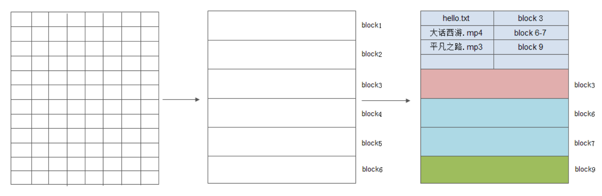

数据存储在磁盘上，物理层面上是在每一个存储单元中，有类似2维的一个一个空间，每一个空间存储1bit或者1byte的数据.
当存储数据的时候都需要知道每一段数据的头地址由此进行读写

这样并不方便管理，所以将整个存储空间划分为更大的单位空间，以block的方式进行管理

在这个文件系统中，除了要维护对应的数据，还需要存储类似于目录一样的元数据块。

---

以上是最基本的一种抽象，block是常常的技巧，但是依旧会有很多事情需要考虑

+ block的大小是固定的吗？大小是多少，如果大小是固定的，如果有很多小文件，那么会有内存碎片等等
+ 文件是有读写的，一个文件的大小可能是不断增长的，当文件超过的他的block空间，他是如何递增空间的？(guess: 文件不一定是顺序的)
