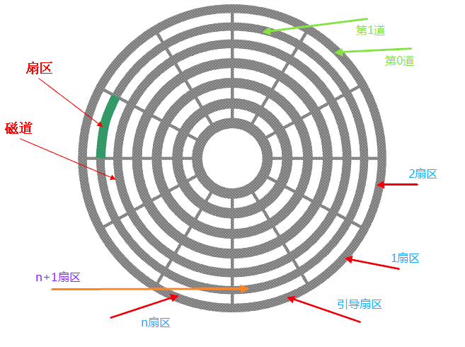
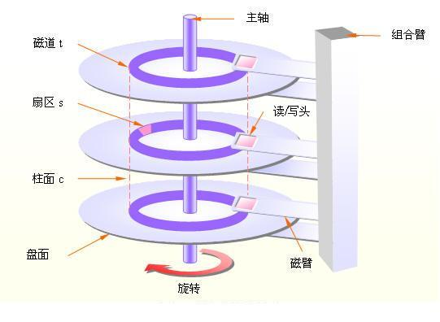

首先是磁盘，磁盘就是在上面电镀了很多的磁粒，每一个磁粒都有磁性，NS级，磁头就是通过NS级转换成为01电信号

然后是盘面，盘面由磁道和扇区组成，一般0磁道的0扇区就是引导扇区，不存储用户数据，而扇区的编号一般并不是如图一样是sequential的，而是一般隔一个扇区加一的原因，因为磁盘转到首先是有惯性的，而且磁头将一个扇区的磁信号转换成为电信号是需要时间的，因此中间隔一个扇区可以说有一定的时间让其进行转换。 扇区是磁盘的最小读写单元。

最后是柱面，在这里其实有两个寻址方法：
+ 3D寻址方法：他是之前的做法，让每一个磁道都有相同的扇区，为了达到这个目的，在内部的磁道中的扇区的存储密度是更大的，这样因为每一个磁道有相同扇区就可以快速定位到xx磁头，xx磁道，xx扇区这种
+ 线性寻址：这是新的设计方法，每一个磁道中的扇区数量不相同，但保证存储密度相同，这样的寻找方法是从外磁道依次到内磁道，以扇区为单位进行线性寻址

---

## 文件系统的设计

文件在磁盘上的存储一定都是扇区的整数倍，就算是一字节的文件也要占用一整个扇区的大小

考虑*兼容性*,因为不同的硬件它的扇区的大小是不同的，因此为了兼容，文件系统提出了一个最小读写逻辑单元块或者簇，扇区是磁盘的最小读写物理单元.
+ 一个块的大小等于扇区的2,4,8等等倍
+ 一个文件占用的空间体积是块的整数倍
+ 块越小，磁盘空间利用率越高，但存储效率会降低
  + 块越小，管理的块越多，元数据占用比例越高
  + 现代磁盘一次 I/O 读取通常以块为单位
  
在文件系统中，设定好了block之后，在底层会有文件系统映射层将block转换为对应扇区，这里就是的block变成了一个抽象统一的标准，而真正对扇区的映射就交给了映射层

