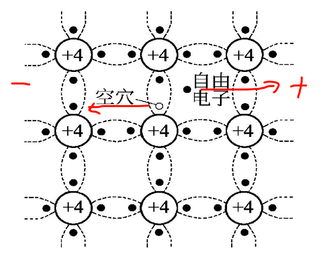
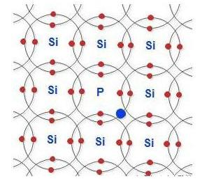
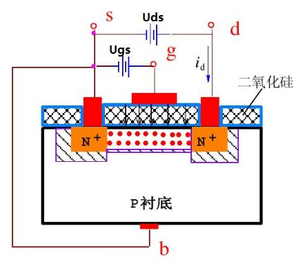
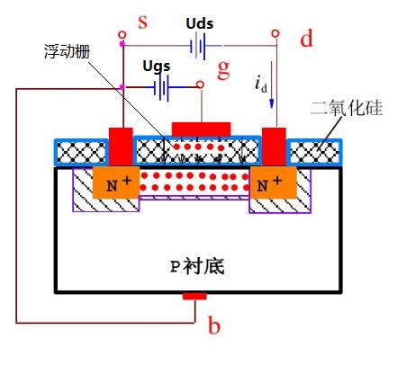
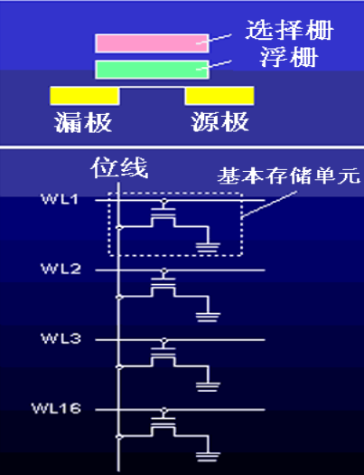
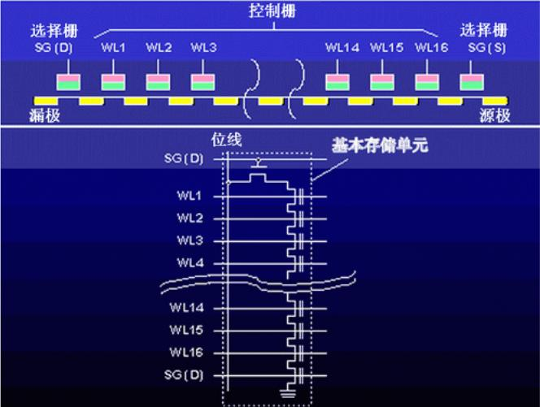
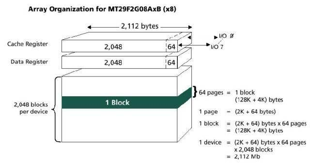

首先我们要理解说文件是如何存储在Flash上的话，首先我们要理解在Flash中是如何存储0，1的

总结来说，从上到下是这样的结构：

1. Flash就是通过双珊极场效应管的方法存储单位的0,1; 
2. 而双珊极场效应管是由场效应管设置而来;
3. 如果要理解场效应管，首先我们要理解半导体导电原理。

我们从下到上开始理解

## 半导体导电原理

首先什么产生电流，产生电流就是电子的定向移动。

在自然界物质可以分为：绝缘体，导体 和 半导体。从化学来说，每一个物质都有自己的最外层的电子，在最外层为8的时候是稳定的，而<4的时候则倾向于失去电子，>4的时候是得到电子，而=4的时候，没有太大的倾向性所以叫半导体。

Si就是这样的半导体，在Si结构中都他们都是会形成共价键从而达到稳定的状态，但是在其中会有一些自由电子，能量比较强，于是他们就会变成自由的电子，然后产生一个+极的空穴，此时，如果在中间加一个电场，就会使得自由电子移动，然后空穴也不断抢夺附近的电子进行移动，但是这样产生的电流是微小的。

为了增大浓度，达到一定程度的时候才能产生电流，有两种方法，通过掺杂半导体的方式
+ N型半导体：掺杂5价元素(P元素，多一个电子和si产生共价键)，电子浓度>>空穴浓度，导电介质是电子
+ P型半导体：掺杂3价元素(Be元素，少一个电子，空穴产生)，空穴浓度>>电子浓度，导电介质是空穴

## 场效应管

那再来说说场效应管是如何导电的

s:源极，d:漏极，g:栅极，b:衬底通常连接到源极或接地 二氧化硅是绝缘体

它的导电方式就是就是首先gb产生一个偏置电压(因为中间有二氧化硅，所以不会产生电流，而是产生电压，吸引电子)，使得在sd之间聚合很多的电子，然后sd之间通电，因为之间有电子，所以可以产生电子之间的定向移动，产生电流，电子从 S 端进入沟道，并被电场推向 D 端，电子到达 D 端后进入外部电路（电源负极） 外部电路中的电子通过电源补充回 S 端，整个回路形成连续的电流流动，因此场效应管能够持续导电

## 双栅极场效应管

那现在就来说说双栅极场效应管是如何通过场效应管改造存储0，1的

就是相比较于说场效应管，在二氧化硅内部有一个被其包裹的栅场，当我们写入0的时候就是向浮动栅中注入电荷，写入1的时候就不注入电荷。

向浮动栅注入电荷就是写入0(d端没有电了) 整个逻辑就是：

1. 施加较高的 V_{GS}（控制栅电压） 和 V_{DS}（漏极电压）。
2. 电子从源极进入沟道，部分电子在电场作用下被加速，获得足够能量跃迁到浮栅。
3. 浮栅存储电子，ds沟道中间没有足够的电子，导致不易导通，d端得到0

同理，写入1就是清除浮栅中的电子，通常使用 FN 隧道效应
1. 施加较高的 负 V_{GS}（控制栅电压）
2. 浮栅中的电子通过隧道效应被拉出，流入衬底（P-substrate）
3. 浮栅没有电子，阈值电压降低，MOSFET 容易导通，d端得到1

## NOR Flash 和 NAND Flash

这两者之间的区别就是双栅极场效应管的连接方式，NOR是并联，就有专有地址线，可以随机寻址，而NAND是串联，不能随机寻址，然后读写操作会比较复杂，因为不仅要设置的位，其他的也要控制，而且因为其中一个有修改其他的也要配合，就次数很多会比较容易出现坏块。但是它的优点就是可以整块擦写操作，速度更快，排线密度要求更低。

---

以上我们理解了说Flash底层是如何存储0，1数据的，以及一个基本单位下flash是如何组织的

当Flash当然不是只存一个基本单位，1byte/2byte这种，就像是在磁盘中我们也不是通过一个一个bit来寻址的

所以在Flash结构中，我们也同样需要更大的单位来帮助我们更快的寻址

## Flash芯片结构

以上是一个Flash芯片结构的例子

+ 每个位线连接8/16/32个基本的存储单元，可以存储1/2/4 Bytes
+ 2048条位线组成的电路构成一个页(page)，容量是2K/4K/8K Bytes
+ 2K个页组成一个块(block)，若干个块构成整个NAND Flash存储芯片

以上的数据只是这个芯片的设计，不同芯片的设计是不同的；但是主要关注的是这个 "页" 和 "块" 的概念

## 寻址方式

Flash使用这样的方式进行组织，就给了更合适的寻址方式

首先理解NAND Flash的寻址是数据线，地址线复用。这个意思就是说，完成寻址的话是需要多个时间周期的。就是首先发送地址，然后是数据，对比来看就是如果数据线和地址线不是复用的，有单独的地址线就可以传地址线后就可以锁定对应的数据，如果写就可以划分同一个周期传递地址和数据。

然后就是他是串行寻址：
+ 以页位最小读写单位，以块位单位擦除
  + 因为以页位读写单位，所以它是不支持随机读写的，因为必须要把整个页读到缓存才能到对应的位置，就像磁盘是以扇区为最小读写单位一样
+ 3次地址发送(块号 + 块内页号 + 页内字节号)，5个时钟周期？（为什么是5个不是4个？）

和磁盘很相似
1. 由控制器驱动进行底层读写
2. 寻址方式都是多级地址
3. 都是以整片为单位进行读写
