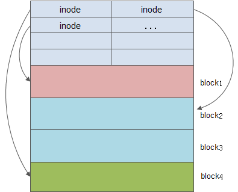

好了，到现在为止我们理解了说在硬件层面上数据的存储，也理解了为了使得文件系统和底层的物理特性解耦合，我们在文件系统中设定了 "逻辑块" 的概念，并且使用 映射层 来实现从逻辑块和物理地址的映射。基于此我们开始使用逻辑块的概念设计文件系统。

首先就是文件系统存储的数据实际上是两个部分

+ 纯数据区
  + 文件真正的数据存储区，基本存储单位是block

+ 元数据区
  + 文件属性：磁盘中的存储位置，文件长度等信息
  + 时间戳：创建时间，修改时间
  + 读写权限：使用read/write系统调用时，首先进行权限检查
  + 所属组，所有者
  + 连接数

所以就是说当文件系统使用的时候，首先会进行格式化，就是将磁盘空间会划分成为block，而且还需要有一个 inode table 用来存储 inode 和 block 位置的映射。



每一个文件都会使用一个inode结构体来描述

每一个inode有固定编号，和单独的存储空间

每一个inode大小是128/256B

Linux系统根据inode来查找文件的存储位置

```bash
// stat xx文件 可以在这里看到对应文件的inode
lqy@lqy:/dev$ stat fd
  文件：fd -> /proc/self/fd
  大小：13              块：0          IO 块大小：4096   符号链接
设备：5h/5d     Inode：393         硬链接：1
权限：(0777/lrwxrwxrwx)  Uid: (    0/    root)   Gid: (    0/    root)
访问时间：2025-03-14 08:50:22.574252251 +0800
修改时间：2025-03-04 16:39:22.792999881 +0800
变更时间：2025-03-04 16:39:22.792999881 +0800
创建时间：2025-03-04 16:39:22.792999881 +0800

// df -i 可以看见对应分区的inode
lqy@lqy:/dev$ df -i
文件系统         Inodes   已用I    可用I 已用I% 挂载点
tmpfs           1702481    1403  1701078     1% /run
/dev/sda3      11763712 1028749 10734963     9% /
tmpfs           1702481     247  1702234     1% /dev/shm
tmpfs           1702481       4  1702477     1% /run/lock
tmpfs           1702481       1  1702480     1% /run/qemu
/dev/sda2             0       0        0      - /boot/efi
tmpfs            340496     237   340259     1% /run/user/1000
/dev/sr0              0       0        0      - /media/lqy/Ubuntu 22.04.3 LTS amd64

// df 看对应分区的block
lqy@lqy:/dev$ df
文件系统          1K的块      已用     可用 已用% 挂载点
tmpfs            1361988      2468  1359520    1% /run
/dev/sda3      184938756 165744196 11026164   94% /
tmpfs            6809924     55712  6754212    1% /dev/shm
tmpfs               5120         4     5116    1% /run/lock
tmpfs            6809924         0  6809924    0% /run/qemu
/dev/sda2         524252      6220   518032    2% /boot/efi
tmpfs            1361984      1740  1360244    1% /run/user/1000
/dev/sr0         4919592   4919592        0  100% /media/lqy/Ubuntu 22.04.3 LTS amd64

// df -h 看分区的大小
lqy@lqy:/dev$ df -h
文件系统        大小  已用  可用 已用% 挂载点
tmpfs           1.3G  2.5M  1.3G    1% /run
/dev/sda3       177G  159G   11G   94% /
tmpfs           6.5G   55M  6.5G    1% /dev/shm
tmpfs           5.0M  4.0K  5.0M    1% /run/lock
tmpfs           6.5G     0  6.5G    0% /run/qemu
/dev/sda2       512M  6.1M  506M    2% /boot/efi
tmpfs           1.3G  1.7M  1.3G    1% /run/user/1000
/dev/sr0        4.7G  4.7G     0  100% /media/lqy/Ubuntu 22.04.3 LTS amd64
```

inode和分区大小没有直接的联系，有可以inode少，因为文件比较少，但是每一个文件都很大，那么分区剩下空间也比较少了，但是如果是一个大的文件，那它的inode也是比较大，因为inode中要存储文件的block地址信息