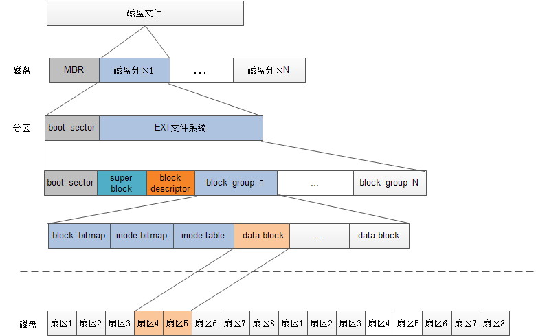
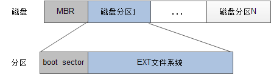
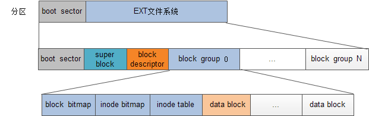

所以就是从04 indoe当中我们理解了说文件系统中我们是使用inode节点来保存和空间地址的映射，那么现在我们还有一个问题，就是在整个文件系统中，因为我们会不断创建，删除等等文件，我们是如何对整个文件系统的状态进行维护的，先在还剩下多少inode?这些等等问题?

因此，引入了superblock, 使用super block

+ 记录整个文件的信息
+ 一个inode,block的大小
+ inode使用情况：已使用数量，未使用数量
+ block使用情况：已使用数量，未使用数量
+ 文件系统挂载情况
+ 文件系统挂载时间，最后一次写入数据，检验磁盘的时间
+ 当文件系统挂载时，这部分信息会加载到内存中，并常驻内存

额，反正整个的逻辑图是：

所以首先是磁盘会进行格式化

分为物理格式化和逻辑格式化
+ 物理格式化：将磁盘分区：MBR中存放分区信息，开机代码
+ 逻辑格式化：在磁盘上安装文件系统，将磁盘分为不同block，不同区段

然后在文件系统的逻辑格式化中，有不同区段

+ boot sector: 引导扇区
+ superblock：记录文件系统的整体信息，inode和block信息
+ block group
  + 每个block group都有一个group description，就是在block Descriptor中存储了N个block group的地址
  + block bitmap: 记录block的使用情况
  + inode bitmap: 记录inode的使用情况
  + inode table, data block

然后就是在内存中，会加载superblock和inode的信息，从而在内存中维护一个文件系统的状态

