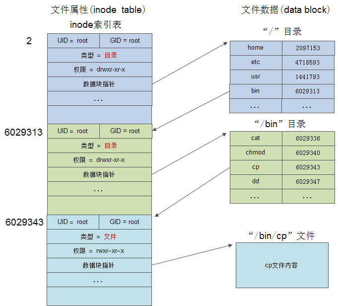

知道了对应的磁盘化格式化之后，知道了文件系统对文件的存储，也知道了在文件系统中使用super block维护对整个分区的状态，使用inode保持数据的地址。但是在我们的使用中我们会发现，我们都是使用文件名或者目录名来保持和数据地址的映射，但是在inode结构中并没有保存文件名部分，是如何实现这样的映射关系的？

其实一个基本的原理都是通过inode建立和对应数据地址的映射，实际上是，目录本质也是一个文件，有自己的inode，在inode中将其标志为目录，而其也会有data block存储这个目录的数据

目录的数据本质上就是一个表格，由若干个目录项组成（文件名和inode编号）。一个目录下面可以有多个文件
+ 文件名和文件对应的inode
+ 多个子目录：目录名和对应inode
+ 多个子目录构成树状的文件系统结构

以上就是一个访问"/bin/cp"文件，首先是对应的"/"目录，这个一般是inode=2的部分，然后我们通过它的inode找到对应的data block，找到对应子目录的inode，然后递归超载就可以找到对应文件的inode，从而映射到对应位置

根目录“/”的inode编号为2，那么inode编号为1的文件是什么？

一般是VFS，Linux的虚拟文件系统